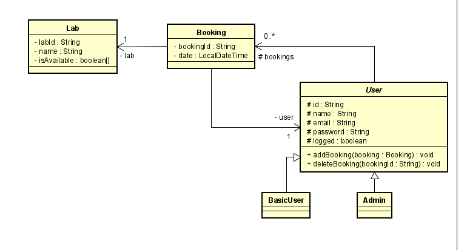
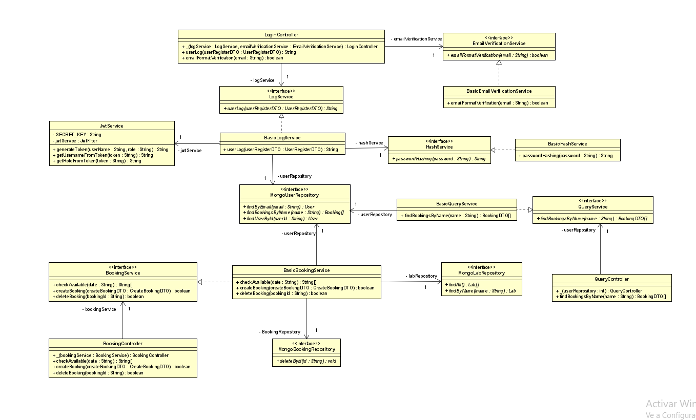
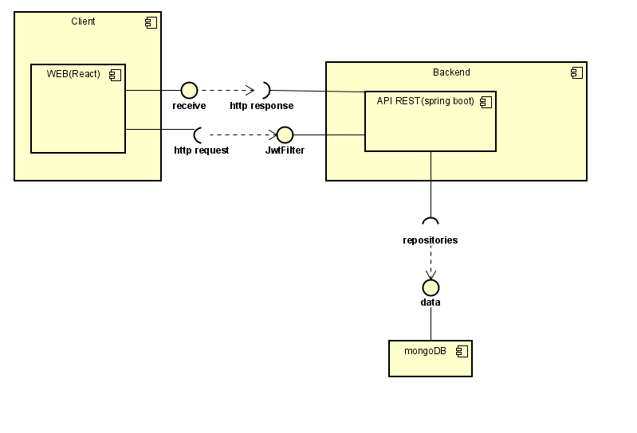
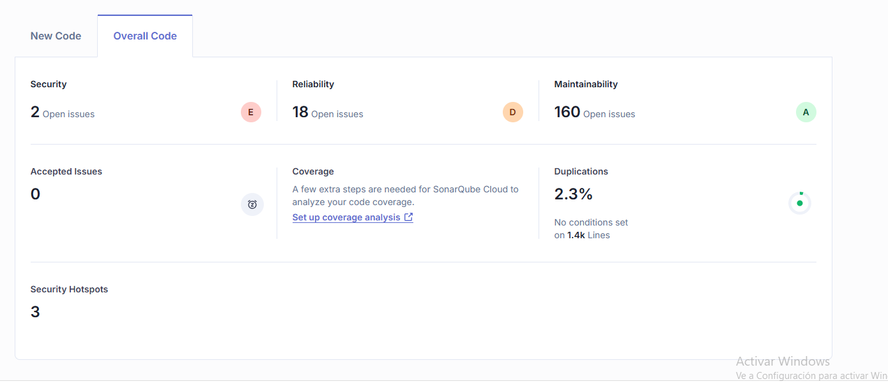
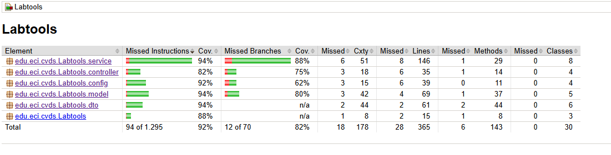

# Skynet2.0Back
## Participantes del proyectoL:
- Miguel Angel Vanegas
- Yojhan Toro
- Ivan Cubillos Vela
## Descripcion del proyecto
- El proyecto es un sistema de reservas de laboratorios, cuenta con dos tipos de usuarios, por un lado
el administrador que tiene la posibilidad de administrar todas las reservas aparte los 
usuairos y los laboratorios. Por otro lado esta el usuario basico, que solo tendra la posibilidad de
administrar sus propias reservas.
- En este repositorio se encuentra el desarrollo del backend de dicha aplicaion
### Desarrollo del backend:
El backend de la aplicación está desarrollado como una API REST utilizando Java con el framework Spring Boot, 
proporcionando una arquitectura robusta y escalable para la gestión de datos y operaciones del sistema.
#### Tecnologias y herramientas
- Java + Spring Boot: Framework utilizado para la construcción de la API REST, facilitando el manejo de 
dependencias, la inyección de dependencias y la estructura modular del backend.

- MongoDB: Base de datos NoSQL utilizada para el almacenamiento de información, lo que permite una alta 
escalabilidad y flexibilidad en el manejo de datos no estructurados o semi-estructurados.

- Spring Data MongoDB: Integración de Spring con MongoDB para facilitar la interacción con la base de 
datos a través de repositorios y consultas dinámicas.

- Spring Security + JWT: Mecanismo de autenticación basado en JSON Web Tokens (JWT) para proteger los 
endpoints de la API y restringir accesos según roles definidos.

- Spring Web: Módulo de Spring utilizado para la exposición de los endpoints RESTful y el manejo de 
peticiones HTTP.

## Funcionamiento general:

1. Autenticación y Seguridad

- Los usuarios se autentican enviando sus credenciales (email y contraseña).

- Si las credenciales son válidas, el sistema genera un JWT, el cual se envía al cliente 
y debe ser incluido en cada petición subsecuente en el header Authorization.

- Un filtro (JwtFilter) intercepta las peticiones y verifica la validez del token antes
de permitir el acceso a los recursos protegidos.

2. Manejo de Usuarios y Roles

- El sistema gestiona usuarios y sus roles directamente en MongoDB.

- Los roles se incluyen en el JWT, permitiendo que el backend determine qué endpoints
pueden ser accedidos según el nivel de permisos del usuario autenticado.

3. Persistencia de Datos

- Se utilizan repositorios de Spring Data MongoDB (MongoRepository) para la comunicación 
con la base de datos.

- La estructura de los documentos en MongoDB se define mediante modelos en Java (@Document), 
lo que permite una integración fluida entre el código y la base de datos.

3. Exposición de Endpoints REST

- Los controladores (@RestController) exponen endpoints para gestionar los recursos de la 
aplicación.

- Se utilizan anotaciones como @GetMapping, @PostMapping, @PutMapping y @DeleteMapping para 
definir las operaciones CRUD disponibles.

4. CORS y Configuración

- Se configura CORS (@CrossOrigin) para permitir el acceso desde diferentes clientes (como 
aplicaciones web o móviles).

- La configuración de seguridad (SecurityFilterChain) permite definir qué endpoints requieren 
autenticación y cuáles son accesibles libremente.

## Diseño de clases:
### Modelo

- El modelo tiene una estructura simple, El usuario guarda sus reservas, con la
intention de facilitar us consulta, y las reservas contiene la información del laboratorio en el 
que se realizó la reserva.
### Diseño controladores, servicion y repositorios

- El diseño se basa en una estructura bastante simple, Los controladores están conectados con los servicios,
y los servicios están conectados con los repositorios correspondientes.
- El uso de las interfaces están fundamentadas en el patron de diseño de inyeccion de dependencias,
se usó en busca de extensibilidad y calidad del codigo, aparte de cumplir con los princiopios SOLID.
- La base del dieseño es que los controladores reciben la peticion, en el servicio se encuentra la logica
del negocio y los repositorios se usa para consultar datos y guardarlos.
### Diagrama de componentes

- En el diagrama se muestra el funcionamiento de la aplicacion, el proyecto sigue una arquitectura MVC (Modelo-Vista-Controlador). 
El cliente manda peticiones al backend, el cual las filtra y responde las que pasen de forma correcta el filtro. 
## Calidad de codigo
### Sonar cloud

## Pruebas Unitarias y de integracion
- Se realizaron pruebas para comprobar que todo el codigo funcione de forma correcta.
- Se probaron de forma aislada y unitaria las funcionalidades, y después se comprobo su correcta integracion con el
resto del codigo.
### Jacoco
- Se hizo uso de jacoco para comprobar el cubrimiento del codigo con dichas pruebas, el resultado es el siguiente.

## [Presentacion](https://www.canva.com/design/DAGjWVCzrtI/bZ0JTORRwdW6vLL1ZjagZQ/edit?utm_content=DAGjWVCzrtI&utm_campaign=designshare&utm_medium=link2&utm_source=sharebutton)
